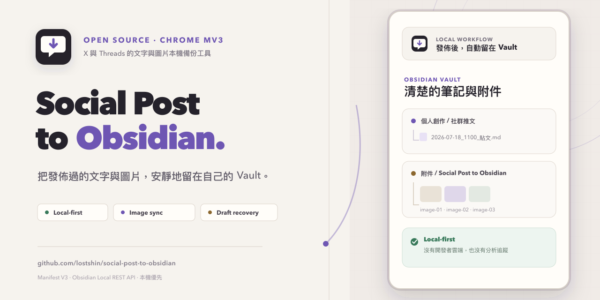

<p align="center">
  
</p>

<h1 align="center">Social Post to Obsidian</h1>

<p align="center">
  發佈 X 與 Threads 貼文後，自動將文字與圖片備份到自己的 Obsidian Vault。
</p>

<p align="center">
  <a href="https://github.com/lostshin/social-post-to-obsidian/actions/workflows/validate.yml"></a>
  <a href="LICENSE"></a>
</p>



## 功能

- 發佈 X 或 Threads 貼文後自動建立 Markdown 筆記
- 將貼文圖片下載到 Vault，並用相對路徑嵌入筆記
- 支援 X 多圖與 Threads 單圖、輪播圖及純圖片貼文
- 保留來源網址、發佈時間、回覆關係與引用貼文
- 打字時暫存草稿，發佈後自動清除草稿檔
- Obsidian 未開啟時加入離線佇列，恢復連線後自動補存
- Popup 顯示連線狀態、未發佈草稿與最近儲存紀錄
- 無第三方 JavaScript 依賴、無雲端服務、無分析追蹤

## 快速開始

### 1. 安裝 Obsidian Local REST API

1. 安裝 [Obsidian](https://obsidian.md/)。
2. 在 Obsidian 的「社群外掛」安裝並啟用 [Local REST API](https://github.com/coddingtonbear/obsidian-local-rest-api)。
3. 開啟 Local REST API 設定頁，保留稍後需要使用的 API Key。

### 2. 下載並載入擴充功能

目前可用開發人員模式安裝；Chrome Web Store 版本仍在準備中。

1. 從 [Releases](https://github.com/lostshin/social-post-to-obsidian/releases) 下載最新的 `social-post-to-obsidian-v*.zip`。若尚無 Release，可先[下載目前原始碼 ZIP](https://github.com/lostshin/social-post-to-obsidian/archive/refs/heads/main.zip)。
2. 解壓縮 ZIP。
3. 在 Chrome 開啟 `chrome://extensions/`。
4. 開啟右上角的「開發人員模式」。
5. 選擇「載入未封裝項目」，指定剛才解壓縮的資料夾。

> Chrome 無法直接載入 ZIP；必須先解壓縮。更新手動安裝版本後，請在擴充功能頁按「重新載入」，再重新整理已開啟的 X／Threads 分頁。

### 3. 連接 Obsidian

1. 將擴充功能固定在 Chrome 工具列並開啟 Popup。
2. 貼上 Local REST API Key。
3. 使用預設 HTTP port `27123`，或 Local REST API 的 HTTPS port `27124`。
4. 視需要調整筆記與圖片在 Vault 內的路徑。
5. 按「測試連線」，成功後再按「儲存設定」。

### 4. 開始使用

保持 Obsidian 與 Local REST API 啟用。照平常方式在 X 或 Threads 撰寫並發佈貼文，擴充功能會自動建立筆記；若 Obsidian 暫時未連線，正式貼文會先進入離線佇列，恢復連線後再補存。

## 儲存結果

筆記預設存放在 `個人創作/社群推文`，圖片預設存放在 Vault 根目錄下的 `附件/Social Post to Obsidian`。兩個路徑都可在 Popup 自訂：

```text
個人創作/社群推文/
└── 2026-07-18_1100_圖片同步測試.md

附件/Social Post to Obsidian/
└── 2026-07-18_1100_圖片同步測試/
    ├── image-01.jpg
    └── image-02.webp
```

Markdown 使用標準相對連結：

```markdown

```

若個別圖片下載失敗，文字筆記仍會正常儲存，並暫時保留該圖片的遠端網址。

## 權限與隱私

所有貼文資料都由瀏覽器直接寫入本機 Obsidian Local REST API，不會傳送到本專案的伺服器，也沒有遙測或分析服務。

擴充功能使用的主要權限如下：

- `storage`：儲存 Local REST API 設定、離線佇列與最近存檔紀錄
- `notifications`：在原始分頁不存在時回報存檔結果
- `alarms`：定期重試離線佇列
- `127.0.0.1`：連接本機 Obsidian Local REST API
- X 與 Meta 圖片 CDN：下載使用者剛發佈貼文中的圖片

API Key 儲存在 Chrome 的 extension local storage。請勿分享包含個人設定的瀏覽器設定檔。

完整資料處理、保存與刪除方式請見[隱私權政策](PRIVACY.md)。

## 已知限制

- 目前同步靜態圖片；影片與動態 GIF 不會下載到 Vault。
- X 與 Threads 的內部 API 結構可能改變；若平台更新造成解析失效，請提交 issue 並附上平台、操作步驟與擴充功能版本，避免貼出 API Key 或私人貼文內容。
- 離線時間過長時，Threads 的簽章圖片網址可能失效；此時筆記仍會保存，但圖片可能只能留下原始遠端連結。

## 開發與驗證

本專案使用原生 JavaScript、HTML 與 CSS，不需要安裝 package。提交前請執行：

```bash
node scripts/validate-extension.mjs
node tests/media-sync.test.mjs
git diff --check
```

驗證內容包含 Manifest 與資產完整性、所有 JavaScript 語法，以及 X／Threads 圖片解析、Vault 二進位寫入、失敗降級與離線重試。

若要建立可上傳 Chrome Web Store 的乾淨 ZIP：

```bash
./scripts/package-extension.sh
```

套件會輸出至 `dist/`。完整開發流程請見[貢獻指南](CONTRIBUTING.md)，上架欄位、權限理由與素材清單請見 [Chrome Web Store 發布指南](docs/CHROME_WEB_STORE.md)。

## 回報問題

- 一般 bug 或功能建議：[GitHub Issues](https://github.com/lostshin/social-post-to-obsidian/issues)
- 安全漏洞：請依[安全政策](SECURITY.md)私下回報，不要公開貼出 API Key、私人貼文或完整平台回應。

## 授權

本專案採用 [MIT License](LICENSE)。
