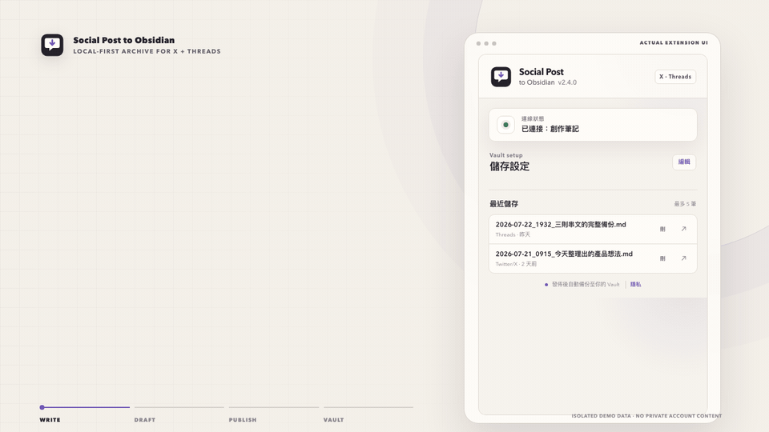

<p align="center">
  
</p>

<h1 align="center">Social Post to Obsidian</h1>

<p align="center">
  <strong>繁體中文</strong> · <a href="README.en.md">English</a>
</p>

<p align="center">
  直接把 X（Twitter）與 Threads 當成筆記軟體。發文後自動存進 Obsidian，不用複製貼上，也不用按擷取按鈕。
</p>

<p align="center">
  <a href="https://chromewebstore.google.com/detail/social-post-to-obsidian/jdfempgjnmdlokacfjmnipihhghcnomb"></a>
  <a href="https://github.com/lostshin/social-post-to-obsidian/stargazers"></a>
  <a href="https://github.com/lostshin/social-post-to-obsidian/actions/workflows/validate.yml"></a>
  <a href="LICENSE"></a>
</p>



這段 20 秒展示使用真實的擴充功能 Popup 與隔離範例資料，不含私人帳號內容；另提供高畫質 [MP4](assets/demo.mp4)。

## 直接把社群媒體當成筆記軟體

你已經在 X（Twitter）或 Threads 寫下想法，為什麼發文後還要再整理一次？

Social Post to Obsidian 會在貼文發佈後，自動把文字、串文與靜態圖片整理成 Markdown，存進你自己的 Obsidian Vault。短短一句會存，一路寫下去的長串文也會存，而且保留原本順序。

發文後，不必回頭按擷取、不必切到 Obsidian，也不必重新整理格式。你照原本的方式寫，筆記會自己存好。

寫作阻力常常出現在寫完之後：切到另一個工具、按下擷取、調整格式，再確認有沒有存好。對 AuDHD 族群而言，這些額外步驟更可能打斷思路，也容易讓「等等再整理」最後變成沒有整理。

社群平台負責讓你開始寫，Obsidian 負責讓內容留下來。你不用另外養成一套筆記習慣，也少了一個中斷寫作的地方。

## 你會得到什麼

- 發佈 X 或 Threads 貼文後，自動建立 Markdown 筆記。
- 單則貼文、連續串文與靜態圖片都會保存；串文維持原本順序。
- 每則內容都有獨立、可直接複製的 Markdown code block。
- 來源網址、發佈時間、回覆關係、引用貼文與串文數量會一起留下來。
- 撰寫時自動暫存草稿；Obsidian 暫時無法使用時，恢復後會自動補存。
- Popup 可預覽、開啟或刪除草稿與最近存檔。
- 沒有第三方 JavaScript、開發者後端、遙測或廣告。

## 支援環境與寫入方式

| 寫入方式 | 平台 | 需要什麼 |
| --- | --- | --- |
| 本機 Helper（預設、推薦） | macOS + Google Chrome | 隨附的開源 Native Helper；不需要 Obsidian 外掛或 API Key |
| Local REST API | macOS、Windows、Linux + Google Chrome | Obsidian 社群外掛 [Local REST API](https://github.com/coddingtonbear/obsidian-local-rest-api) 與 API Key |

兩種模式都需要 [Obsidian](https://obsidian.md/)。本機 Helper 目前只支援 macOS；其他系統請在 Popup 選擇 Local REST API。

## 安裝

完整步驟、更新方式與移除方法請見 [INSTALL.md](INSTALL.md)。以下是最短流程。

### 從 GitHub Release 手動安裝

1. 從 [Releases](https://github.com/lostshin/social-post-to-obsidian/releases) 下載 `social-post-to-obsidian-v*.zip` 並解壓縮到固定資料夾。
2. 開啟 `chrome://extensions/` → 啟用「開發人員模式」→「載入未封裝項目」→ 選擇含 `manifest.json` 的資料夾。
3. macOS 使用者若採本機 Helper，在該資料夾執行：

   ```bash
   ./native/install-host.sh
   ```

4. 在 `chrome://extensions/` 重新載入外掛，開啟 Popup，按「選擇 Vault」。

Chrome 不能直接載入 ZIP。更新手動安裝版時也要保留相同資料夾位置，否則 extension ID、既有設定與 Helper 授權可能改變。

### 從 Chrome Web Store 安裝

1. 從 [Chrome Web Store](https://chromewebstore.google.com/detail/social-post-to-obsidian/jdfempgjnmdlokacfjmnipihhghcnomb) 安裝擴充功能。
2. 若要使用預設的本機 Helper，從同版本 [GitHub Release](https://github.com/lostshin/social-post-to-obsidian/releases) 下載 `social-post-to-obsidian-helper-v*-macos.zip`。
3. 解壓縮後執行：

```bash
./native/install-host.sh jdfempgjnmdlokacfjmnipihhghcnomb
```

Chrome Web Store 基於安全限制不會自動執行本機安裝程式。若不想安裝 Helper，可改用 Local REST API 模式。

## 設定與使用

1. 將擴充功能固定在 Chrome 工具列並開啟 Popup。
2. 本機 Helper 模式：按「選擇 Vault」，選擇含 `.obsidian` 的 Vault 根目錄。
3. Local REST API 模式：輸入 API Key、HTTP port `27123` 或 HTTPS port `27124`，再測試連線。
4. 視需要調整筆記路徑與圖片路徑，按「儲存設定」。
5. 重新整理已開啟的 X／Threads 分頁，照平常方式撰寫並發佈貼文。

Popup 的「未發佈草稿」與「最近儲存」可顯示內容預覽；箭頭會開啟 Obsidian 筆記，垃圾桶只刪除 Vault 筆記，不會刪除社群平台原文。

## 儲存結果

預設筆記路徑是 `個人創作/社群推文`，預設圖片路徑是 `附件/Social Post to Obsidian`：

```text
個人創作/社群推文/
└── 2026-07-18_1100_圖片同步測試.md

附件/Social Post to Obsidian/
└── 2026-07-18_1100_圖片同步測試/
    ├── image-01.jpg
    └── image-02.webp
```

Markdown 使用可從筆記位置解析的標準相對連結。若個別圖片下載失敗，文字筆記仍會儲存，該圖片則保留遠端網址。

## 權限與資料流

擴充功能只在使用者自己的裝置與選定服務間處理資料：

```text
X／Threads 分頁
  → Chrome extension
  → macOS Native Helper 或 127.0.0.1 Local REST API
  → 使用者自己的 Obsidian Vault
```

- `storage`：保存寫入模式、路徑、可選的 REST API 設定、離線佇列及最近存檔資訊。
- `nativeMessaging`：在 macOS 與使用者自行安裝的本機 Helper 溝通。
- `notifications`：原始分頁已關閉時回報正式貼文的存檔結果。
- `alarms`：定期補存離線佇列與維護 Vault 狀態。
- X／Threads 網站存取：只處理使用者正在撰寫或剛發佈的貼文及相關來源資訊。
- X／Meta 圖片 CDN：下載該貼文中的靜態圖片。
- `127.0.0.1`：只供使用者選擇 Local REST API 模式時連接本機 Obsidian 外掛。

專案沒有開發者營運的伺服器，不販售或分享資料，也不執行遠端程式碼。詳情見[隱私權政策](PRIVACY.md)。

## 已知限制

- Native Helper 目前只支援 macOS 與 Google Chrome；Windows、Linux 或其他 Chromium 瀏覽器請使用 Local REST API，或自行貢獻對應安裝支援。
- 目前只同步靜態圖片；影片與動態 GIF 不會下載。
- X 與 Threads 的內部 API 可能改變。回報解析問題時請移除 API Key、cookies、私人貼文與完整平台回應。
- Threads 圖片網址帶有時效簽章；離線過久後可能只能留下遠端網址。
- iCloud Vault 首次刪除筆記時，macOS 可能要求允許 Ruby／Chrome 控制 Finder。

## Roadmap

專案方向公開記錄在帶有 [`roadmap` label](https://github.com/lostshin/social-post-to-obsidian/issues?q=state%3Aopen%20label%3Aroadmap) 的 issues，目前探索項目包括：

- [Windows／Linux Native Helper](https://github.com/lostshin/social-post-to-obsidian/issues/2)
- [Chromium 瀏覽器相容性](https://github.com/lostshin/social-post-to-obsidian/issues/3)
- [影片與動態 GIF 的本機保存](https://github.com/lostshin/social-post-to-obsidian/issues/4)
- [Release 套件的瀏覽器層 smoke tests](https://github.com/lostshin/social-post-to-obsidian/issues/5)

Roadmap issues 表示想解決的問題，不代表承諾發布日期；真實工作流程的驗證會優先於功能數量。

## 開發、測試與發布

本專案使用原生 JavaScript、HTML、CSS 與 macOS 系統 Ruby，不需要安裝 npm package。提交前執行：

```bash
node scripts/validate-extension.mjs
node tests/media-sync.test.mjs
./scripts/package-extension.sh
git diff --check
```

打包後 `dist/` 會包含：

- `social-post-to-obsidian-v<version>.zip`：GitHub 手動安裝與 Chrome Web Store 上傳套件。
- `social-post-to-obsidian-helper-v<version>-macos.zip`：商店版使用者需要的 macOS Helper。
- `SHA256SUMS`：兩個 ZIP 的 SHA-256 checksum。

貢獻方式見 [CONTRIBUTING.md](CONTRIBUTING.md)，Chrome Web Store 欄位、權限理由與審查步驟見 [docs/CHROME_WEB_STORE.md](docs/CHROME_WEB_STORE.md)。

## 回報與授權

- Bug 與功能建議：[GitHub Issues](https://github.com/lostshin/social-post-to-obsidian/issues)
- 安全漏洞：[SECURITY.md](SECURITY.md)
- 授權：[MIT License](LICENSE)

本專案是獨立開源工具，未受 X、Meta、Threads、Obsidian 或其關係企業贊助、認可或維護。

如果這個工具讓你少一次切換、多留下幾篇文章，歡迎替 repository 點一顆星，讓更多想降低寫作阻力的人看見它。
